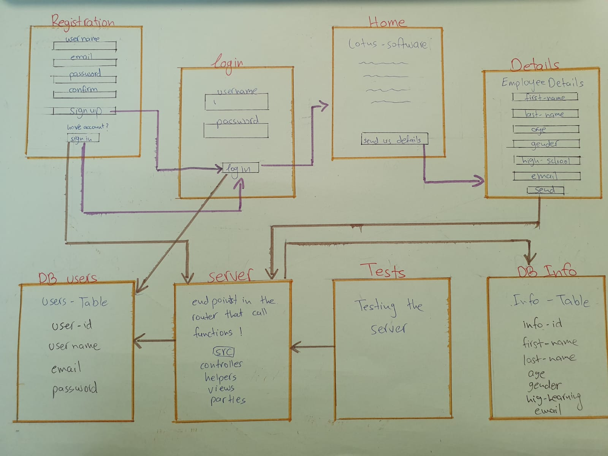
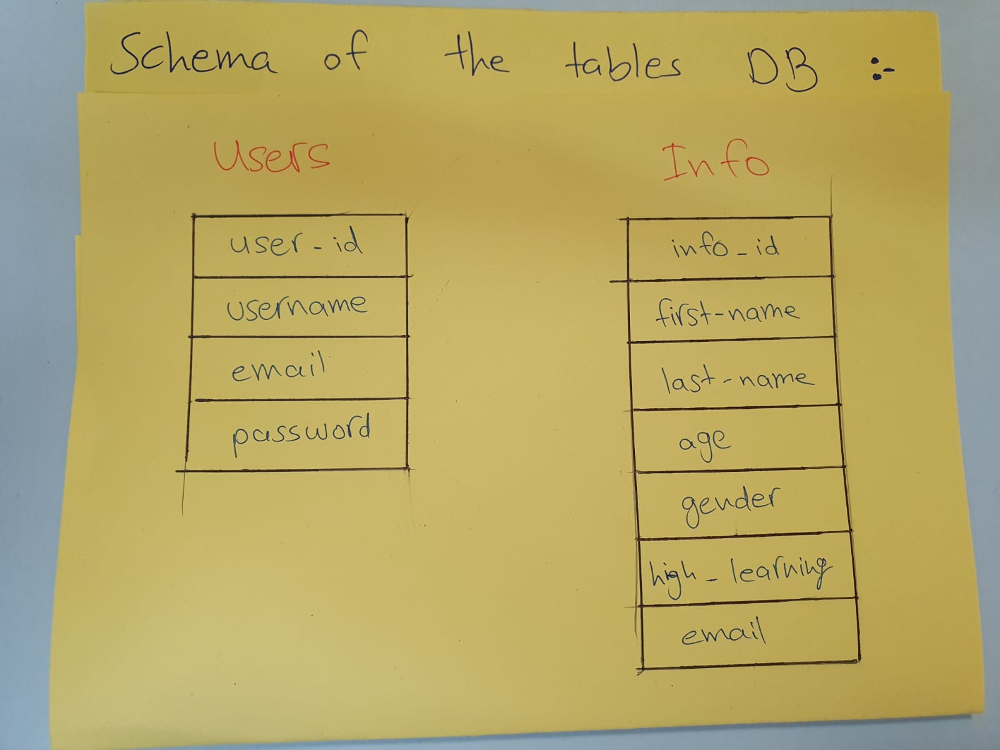

# Lotus-Software :office:
### An information web page for Lotus software by Maha &amp; Sahar &amp; Sara &amp; Aman :rose:

## Welcome to our application! :confetti_ball:

## TO visit our website click on this [link]('https://aqueous-inlet-95922.herokuapp.com/')

#### In our website you will find a lot of information about Lotus software, you have to sign up in order to visit our website!

### In this project we coded our code by using the express.js framework.
### We have in our app three pages :
#### :one: When you visit our website, the first page will shown is the signing page.
####  :two: after you sign up, your information sent and saved in our database.
#### :three: when you succeeded to log in, you can visit the website and get all the information about Lotus company.
#### :four: If you interested to become an employee in Lotus company, send us your details, if you passed our conditions, so we will send you a message that you became an employee in Lotus company  :tada:

#### Start by our Architecture : :bar_chart:

 #### When the user types a data, the data fetched to the server side by the endpoints.In the server the router file calles get functions  from the queries that add the data to the dataBase tables! And when we want to compare the password for example, the router calles the post functions from the queries and give us the data we want!

 #### The dataBase Schema :

#### Contact Details ::telephone_receiver:
#### If you have any question or suggestions. please free to contact us :telephone_receiver:
andvice versa
#### :blue_heart: Aman : @amanhalabyar   
#### :purple_heart: Maha : @maha276  
#### :green_heart: Sahar: @saharsaker   
#### :heart: Sara:  @sara141

#### Hope you like it ..
#### Thank you for visiting :rose:
